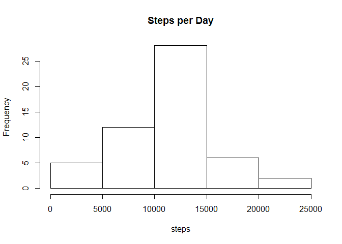
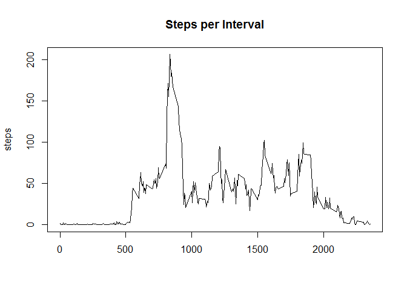
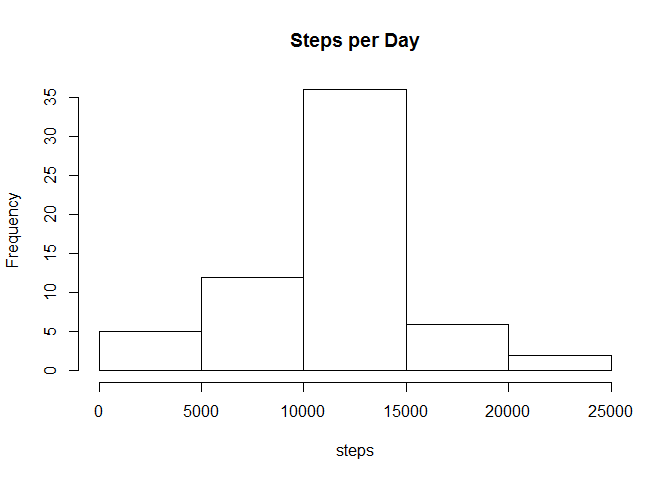

# Reproducible Research - Assignment 1
Stefan from Holland  
Feb 03 2017  


## Introduciton

This assignment makes use of data from a personal activity monitoring device. This device collects data at 5 minute intervals through out the day. The data consists of two months of data from an anonymous individual collected during the months of October and November, 2012 and include the number of steps taken in 5 minute intervals each day.

## Read in Data

We are now gonna read in the data:


```r
raw_data = read.csv("activity.csv")
```

and process/transform it:


```r
data = raw_data[!is.na(raw_data$steps),]
data$date=as.Date(data$date)
```

## Steps per day

To calculate the steps per day:

```r
steps_per_day = aggregate(data$steps, by=list(data$date), FUN=sum)
colnames(steps_per_day)=c("date","steps")
```

and plot a histogram:

```r
hist(steps_per_day$steps,xlab='steps',main = 'Steps per Day')
```

<!-- -->

To calculate the mean and median:


```r
mean(steps_per_day$steps)
```

```
## [1] 10766.19
```

```r
median(steps_per_day$steps)
```

```
## [1] 10765
```

## Average daily activity pattern

To calcaulate the average steps per interval:

```r
steps_per_interval = aggregate(data$steps, by=list(data$interval), FUN=mean)
colnames(steps_per_interval)=c("interval","steps")
```

and plot the timeseties:


```r
plot(x=steps_per_interval$interval,y=steps_per_interval$steps,xlab = '',ylab='steps',type='l',main = 'Steps per Interval')
```

<!-- -->

The next 5-minute interval, on average across all the days in the dataset, contains the maximum number of steps:


```r
steps_per_interval$interval[which.max(steps_per_interval$steps)]
```

```
## [1] 835
```


## Imputing missing values

There are a number of days/intervals where there are missing values (coded as NA). The presence of missing days may introduce bias into some calculations or summaries of the data.

The number of missing values in the dataset equals

```r
sum(is.na(raw_data$steps))
```

```
## [1] 2304
```

To fill up the missing values, we create a new dataset called data_nona


```r
data_nona = raw_data
data_nona$date=as.Date(data_nona$date)
data_nona$steps[is.na(data_nona$steps)] = mean(data_nona$steps,na.rm = TRUE)
```

and show the histogram:


```r
steps_per_day = aggregate(data_nona$steps, by=list(data_nona$date), FUN=sum)
colnames(steps_per_day)=c("date","steps")
hist(steps_per_day$steps,xlab='steps',main = 'Steps per Day')
```

<!-- -->


and calculate mean and median:


```r
mean(steps_per_day$steps)
```

```
## [1] 10766.19
```

```r
median(steps_per_day$steps)
```

```
## [1] 10766.19
```

we see that there is a minor difference of 1.19 steps in median

## Are there differences in activity patterns between weekdays and weekends?

Next, we investigate patterns in weekday and weekends.


We create another factor, called 'weekday'


```r
data_nona_w = data_nona
data_nona_w$weekday = 'weekday'
data_nona_w$weekday[weekdays(data_nona_w$date) %in% c(sunday_in_local_language,saturday_in_local_language)] = 'weekend'
```

to plot steps per interval for weekdays and weekends:


```r
data_nona_weekend = data_nona_w[data_nona_w$weekday=='weekend',]
steps_per_day_weekend = aggregate(data_nona_weekend$steps, by=list(data_nona_weekend$interval), FUN=mean)
colnames(steps_per_day_weekend)=c("interval","steps")

data_nona_weekday = data_nona_w[data_nona_w$weekday=='weekday',]
steps_per_day_weekday = aggregate(data_nona_weekday$steps, by=list(data_nona_weekday$interval), FUN=mean)
colnames(steps_per_day_weekday)=c("interval","steps")

par(mfrow=c(2,1))
plot(x=steps_per_day_weekend$interval,y=steps_per_day_weekend$steps,type='l',xlab = 'interval',ylab = 'steps',main='Steps per interval - weekend')
plot(x=steps_per_day_weekday$interval,y=steps_per_day_weekday$steps,type='l',xlab = 'interval',ylab = 'steps',main='Steps per interval - weekdays')
```

<!-- -->
